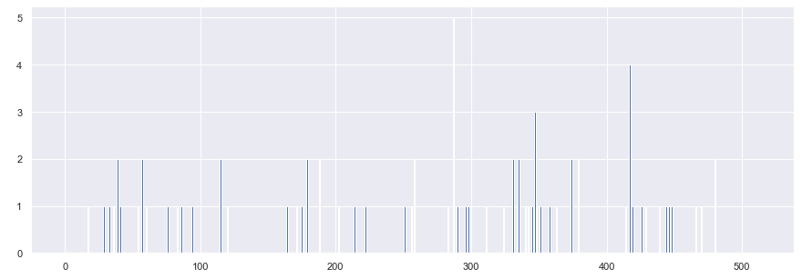

# Classifications of images for surveying product impacts 

Some simple classifications of images  are performed based on bag-of-features with SIFT algorithm and CNN using Tensorflow for a further study on product cluster impacts on customer habits.
Before performing any image treatment and resizing. As example, an image is picked and some classical image treatments, such as the histogram equlization, are displayed in the notebook.

To perform a proper classification, BoF are computed. As an example, here is the histogram of one product based on the 512 features computed from the SIFT algorithm.

Then some other classical techniques are used to find the optimal number of cluster such as the elbow method. In the present case, for the sift algorithm based on 512 features for pictures of 112x112 pixels, the optimal number of cluster is 6.

Finally one can look at the cluster. Here are 2D projections of the 6 clusters. This result is then compared with the result computed by the CNN. 

Future Work: increase the size of the image and the number of features for the bag-of-features based on SIFT algorithm and CNN and see how it influences the quality of the clusters based on the metrics developed in this notebook.
